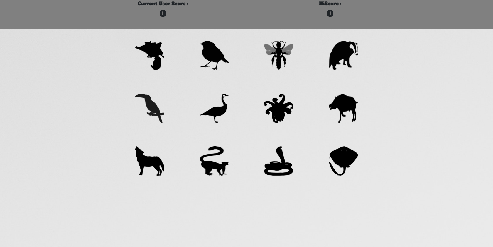

Clicky Clicker
=====

Description
----
A game where you click a image to get a point however not the same one. 

Link to the [Site](https://div-clicker.herokuapp.com/)

Requirements
------------
*node.js*

A run time environment that allows to use of javascript code outside the browser.

> you can download the installer  at https://nodejs.org/en/

Installation
----
*Clone Repository*

> git clone => https://github.com/JetenderG/Word-Guess-Game.git

*Install Necessary Files*

>npm install

*Run*
>npm run

Built With
---

- [React.js](https://reactjs.org/) Front-end Framework
- [Node.js](https://nodejs.org/en/) Environment Javascript Runtime
- [Bootstrap](https://getbootstrap.com/) CSS FrameWork
- [Jquery](https://jquery.com/) Javascript Library

    
